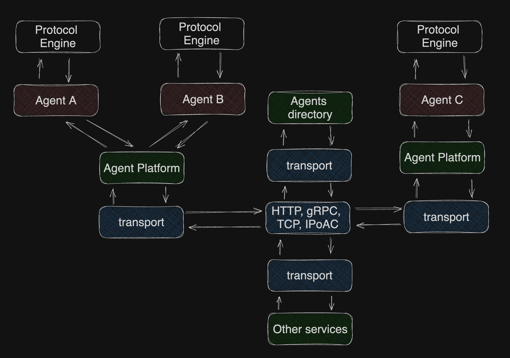

# Mycelium

_[AutoGen](https://github.com/microsoft/autogen), but for hundreds or thousands of distributed agents_

Mycelium is framework for building mult-agent systems in which agents can communicate in natural language (LLM-based agents). Its primary goal is to provide tools for direct and group collaboration among agents.

**Mycelium is in its very early stages**

## Protocol

The protocol dictates specific guidelines for both the composition and sequencing of messages within a dialogue, imposing restrictions on either or both aspects.

## Ideal protocol

- [ ] Messages to services
- [ ] Multiple agents
- [ ] Schemas for messages
- [ ] Group collaboration topology
- [ ] Roles
- [ ] Nested protocols
- [x] Protocol prompt for agent
- [x] Infinite loops
- [x] Guiding prompts for agents
- [ ] Versioning
- [ ] Protocol inheritance
- [ ] Serializable protocol definition (no extra code required to use protocol)

# Plan:

1. Implement basic agent class for testing
2. Create test scenarios
3. Evaluate speech act approach
